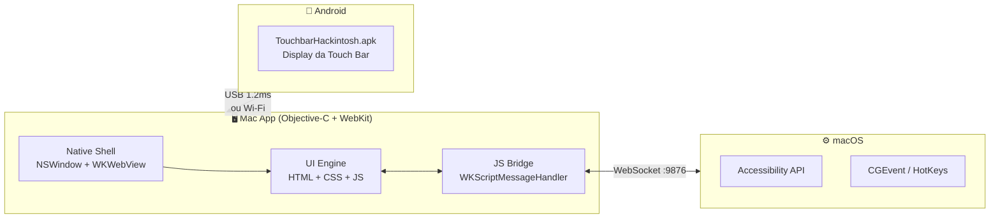

<div align="center">


# MacTouchBar Studio

**Transforme seu iPhone ou iPad em uma Touch Bar para o Mac.**

[](https://apple.com/macos)
[](TouchbarHackintosh.apk)
[](https://developer.apple.com/documentation/objectivec)
[](LICENSE)
[](https://github.com/luxfajah/mactouchbar-studio)

</div>

---

## ✨ O que é

O **MacTouchBar Studio** é composto de dois componentes que funcionam juntos:

| Componente | Descrição |
|---|---|
| 🍎 **Mac App** (`mac-app-beta/`) | App nativo macOS — painel de controle, simulador e ponte de atalhos |
| 📱 **Android APK** (`TouchbarHackintosh.apk`) | App Android que exibe a Touch Bar no dispositivo em tempo real |

A comunicação acontece via **Cabo USB (~1.2ms)** ou **Wi-Fi WebSocket**, com o Mac app fazendo a ponte entre o dispositivo e os aplicativos do macOS (Illustrator, Photoshop, Figma, etc.).

---

## 📸 Screenshots

<div align="center">

### Tela Principal — Simulador Interativo


### Tela de Conexão — USB & Wi-Fi


### Perfil Illustrator — Cores & Tipografia


### Editor de Dock — Atalhos Personalizados


</div>

---

## 🏗 Arquitetura



### Como funciona

```
[Android/iOS]  ──USB/Wi-Fi──►  [Mac App]  ──WebSocket──►  [macOS API]
   Exibe a                      Recebe o                    Executa o
   Touch Bar                    comando                     atalho
```

1. O **APK Android** exibe a Touch Bar customizada na tela do dispositivo
2. Ao tocar em um botão, envia um comando via USB ou Wi-Fi para o Mac
3. O **Mac App** recebe via WebSocket (porta 9876) e executa o atalho
4. A Accessibility API do macOS injeta o evento no app em foco

---

## 📁 Estrutura

```
mactouchbar-studio/
│
├── mac-app-beta/               # 🍎 App macOS
│   ├── main.m                  # Entry point: NSWindow + WKWebView + JS Bridge
│   ├── index.html              # UI completa (HTML/CSS/JS)
│   ├── Info.plist              # Bundle metadata
│   ├── build_beta.sh           # Build + install automático em /Applications
│   ├── Views/                  # SwiftUI (referência)
│   └── Models/                 # SystemMonitor, AppProfile
│
├── TouchbarHackintosh.apk      # 📱 App Android (cliente Touch Bar)
│
└── docs/
    └── screenshots/            # 📸 Capturas de tela
```

---

## 🛠 Tech Stack

| Camada | Tecnologia |
|---|---|
| **Mac — Shell nativo** | Objective-C · Cocoa · AppKit · Carbon |
| **Mac — UI Engine** | HTML5 · CSS3 · JS · WebKit |
| **Mac — Bridge** | `WKScriptMessageHandler` (JS ↔ ObjC) |
| **Android Client** | APK instalável (sideload) |
| **Transporte** | USB `~1.2ms` · Wi-Fi WebSocket |
| **Appearance** | Apple HIG · `NSAppearance` · `color-scheme` |

---

## 🚀 Instalação

### Mac App

**Pré-requisito:** Xcode Command Line Tools  
```bash
xcode-select --install
```

```bash
# Clonar o repositório
git clone git@github.com:luxfajah/mactouchbar-studio.git
cd mactouchbar-studio

# Compilar e instalar em /Applications automaticamente
bash mac-app-beta/build_beta.sh
```

### Android APK

1. Transfira `TouchbarHackintosh.apk` para o Android
2. Habilite **"Instalar apps desconhecidos"** nas configurações
3. Abra o APK e instale
4. Conecte via USB ou Wi-Fi ao Mac App

---

## 📄 Licença

MIT © 2026 [luxfajah](https://github.com/luxfajah)

---

<div align="center">
  <sub>Feito com ❤️ para criadores que vivem no Mac.</sub>
</div>
