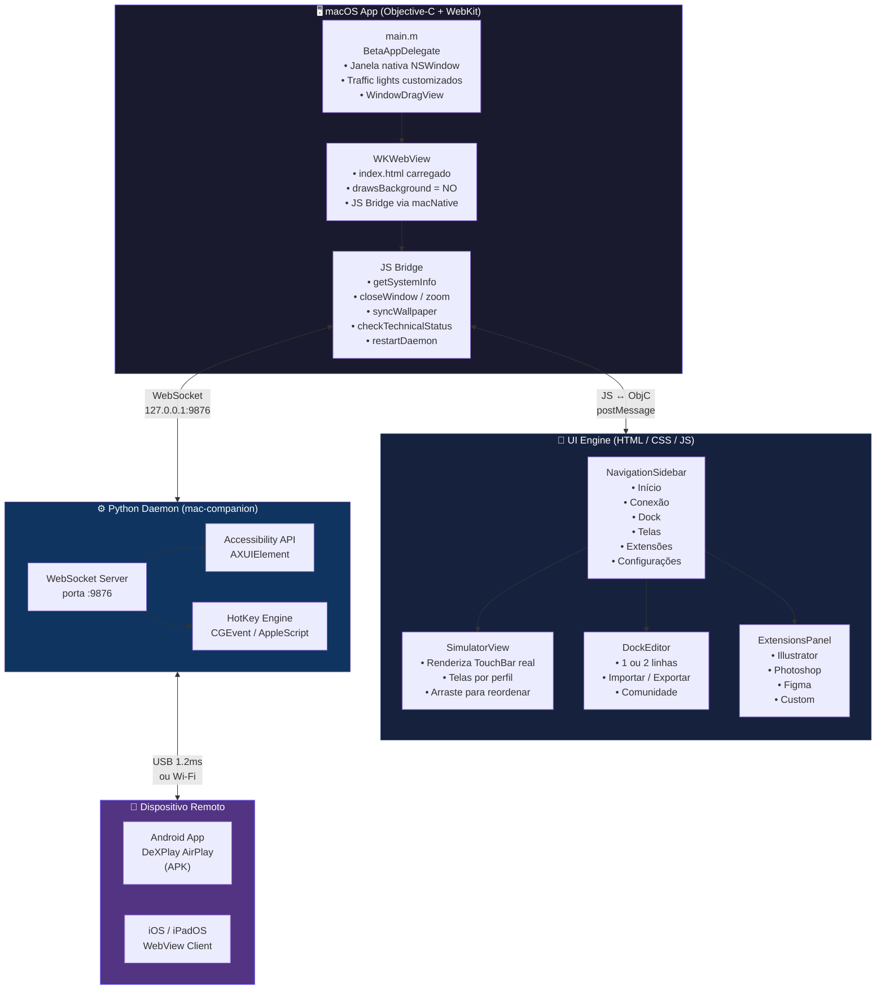

<div align="center">


# MacTouchBar Studio

**Transforme seu iPhone ou iPad em uma Touch Bar para o Mac.**

[](https://apple.com/macos)
[](https://developer.apple.com/documentation/objectivec)
[](https://developer.apple.com/documentation/webkit/wkwebview)
[](LICENSE)
[](https://github.com/luxfajah/mactouchbar-studio)

</div>

---

## ✨ O que é

O **MacTouchBar Studio** é um app nativo para macOS que permite usar um **iPhone ou iPad como Touch Bar**, enviando atalhos de teclado, ações e macros em tempo real para aplicativos como Illustrator, Photoshop, Figma e outros — via **Cabo USB (1.2ms)** ou **Wi-Fi**.

A interface foi construída com tecnologia híbrida: o **shell nativo é Objective-C puro (Cocoa + WebKit)**, e a UI interna é um motor HTML/CSS/JS de alta fidelidade que respeita as [Apple Human Interface Guidelines](https://developer.apple.com/design/human-interface-guidelines/).

---

## 📸 Screenshots

<div align="center">

### Tela Principal — Simulador Interativo


### Tela de Conexão — USB & Wi-Fi


### Perfil Illustrator — Cores & Tipografia


### Editor de Dock — Atalhos Personalizados


</div>

---

## 🏗 Arquitetura

O projeto é dividido em **quatro camadas** que se comunicam em tempo real:

```
┌─────────────────────────────────────────────────────────┐
│                     MacTouchBar Studio                  │
│  ┌───────────────────┐   ┌──────────────────────────┐   │
│  │   Native Shell    │   │      WebKit UI Engine    │   │
│  │  (Objective-C)    │◄──►    (HTML + CSS + JS)     │   │
│  │                   │   │                          │   │
│  │ • NSWindow        │   │ • NavigationSidebar      │   │
│  │ • WKWebView       │   │ • SimulatorView          │   │
│  │ • JS Bridge       │   │ • DockEditor             │   │
│  │ • Wallpaper Sync  │   │ • ProfileManager         │   │
│  │ • Appearance      │   │ • ExtensionsPanel        │   │
│  └────────┬──────────┘   └──────────────────────────┘   │
│           │ WebSocket (porta 9876)                       │
│  ┌────────▼──────────┐                                   │
│  │   Python Daemon   │   (mac-companion)                 │
│  │  mac_deck_server  │◄── Executa atalhos no macOS       │
│  └────────┬──────────┘                                   │
└───────────┼─────────────────────────────────────────────┘
            │ USB (ADB / usbmuxd) ou Wi-Fi WebSocket
┌───────────▼─────────────────────────────────────────────┐
│            App Android / iOS                            │
│  ┌─────────────────────────────────────────────────┐    │
│  │  TouchBar Display  (DeXPlay AirPlay / WebView)  │    │
│  └─────────────────────────────────────────────────┘    │
└─────────────────────────────────────────────────────────┘
```

### Diagrama de Componentes Detalhado



---

## 📁 Estrutura do Projeto

```
MacTouchBar-Studio/
│
├── mac-app-beta/               # 🍎 App macOS (foco principal)
│   ├── main.m                  # Entry point: NSWindow + WKWebView + JS Bridge
│   ├── index.html              # UI completa (15k+ linhas, HTML/CSS/JS)
│   ├── Info.plist              # Bundle metadata
│   ├── build_beta.sh           # Build + Install automático em /Applications
│   ├── Views/                  # SwiftUI views (draft / referência)
│   │   ├── MainView.swift      # NavigationSplitView
│   │   ├── DashboardView.swift # Painel de métricas
│   │   ├── ProfileEditorView.swift
│   │   ├── ShortcutTesterView.swift
│   │   └── LogConsoleView.swift
│   └── Models/
│       ├── SystemMonitor.swift # Monitor de sistema nativo
│       └── AppProfile.swift    # Modelo de perfis de apps
│
├── mac-companion/              # ⚙️ Daemon Python WebSocket (:9876)
│   └── mac_deck_server.py      # Servidor de execução de atalhos
│
├── touchbar-hackintosh/        # 📱 App Android (Kotlin + ADB)
│   └── src/main/               # Interface Touch Bar no Android
│
├── ipados-preview/             # 🎭 Simulador iPadOS no browser
├── docs/
│   └── screenshots/            # 📸 Capturas de tela para o README
│
├── DeXPlay-AirPlay.apk         # APK compilado (Android)
├── build.gradle.kts            # Gradle config (Android)
└── README.md
```

---

## 🛠 Stack Técnica

| Camada | Tecnologia |
|---|---|
| **Shell nativo** | Objective-C • Cocoa • AppKit • Carbon |
| **UI Engine** | HTML5 • CSS3 • Vanilla JS • WebKit |
| **Bridge** | `WKScriptMessageHandler` (JS ↔ ObjC) |
| **Daemon** | Python 3 • WebSockets • asyncio |
| **Android Client** | Kotlin • Jetpack Compose • ADB |
| **Transporte** | USB (usbmuxd, ~1.2ms) • Wi-Fi WebSocket |
| **Appearance** | Apple HIG Dark Mode • `color-scheme` • `NSAppearance` |

---

## 🚀 Build & Instalação

### Pré-requisitos

- macOS 13 Ventura ou superior
- Xcode Command Line Tools: `xcode-select --install`
- Python 3.9+ (para o daemon)

### Compilar e Instalar

```bash
# Clonar o repositório
git clone git@github.com:luxfajah/mactouchbar-studio.git
cd mactouchbar-studio

# Build + install automático em /Applications
bash mac-app-beta/build_beta.sh
```

O script:
1. 📁 Monta o bundle `.app`
2. 🔨 Compila `main.m` com `clang` (Cocoa + WebKit + Carbon)
3. 🔏 Assina o bundle com identidade ad-hoc
4. 📦 Instala automaticamente em `/Applications/MacTouchBarBeta.app`

### Iniciar o Daemon

```bash
# Iniciar o servidor WebSocket Python
python3 mac-companion/mac_deck_server.py
# Ou usar o script de conveniência:
bash Iniciar-MacDeck-Server.command
```

---

## 🔌 Protocolo de Comunicação

```
iPhone/iPad → WebSocket → Daemon Python → macOS Accessibility API
                                       ↘ CGEvent (teclado/mouse)
                                       ↘ AppleScript
                                       ↘ NSDistributedNotificationCenter
```

Mensagens trocadas via WebSocket são JSON simples:

```json
{ "action": "shortcut", "key": "g", "modifiers": ["cmd"] }
{ "action": "align_center_artboard" }
{ "action": "switch_profile", "appBundleId": "com.adobe.illustrator" }
```

---

## 🎨 Design System

A UI segue as [Apple Human Interface Guidelines](https://developer.apple.com/design/human-interface-guidelines/):

- **Dark Mode nativo**: `color-scheme: dark light` + `NSAppearanceNameDarkAqua` no `NSWindow`
- **Scrollbars**: Overlay scrollbars nativos do macOS (sem CSS customizado), adaptam-se automaticamente ao tema
- **Cores**: CSS Custom Properties com `@media (prefers-color-scheme)` e fallback JS via `body.theme-dark/light`
- **Tipografia**: `-apple-system, SF Pro Text, SF Pro Display`
- **Janela**: `NSWindowStyleMaskFullSizeContentView` com titlebar transparente e traffic lights reposicionados

---

## 📄 Licença

MIT © 2026 [luxfajah](https://github.com/luxfajah)

---

<div align="center">
  <sub>Feito com ❤️ para criadores que vivem no Mac.</sub>
</div>
