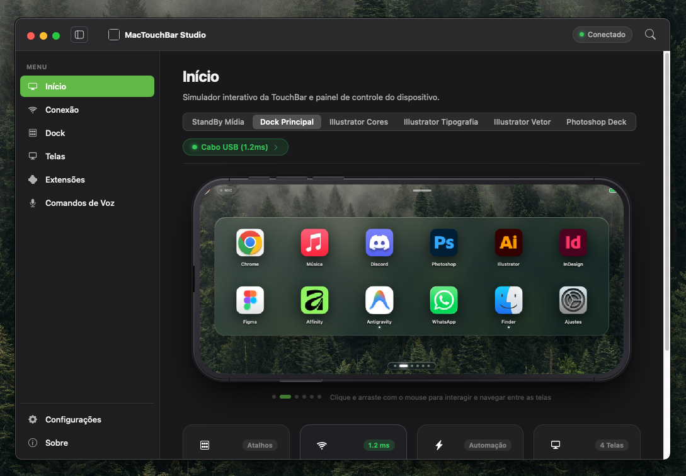
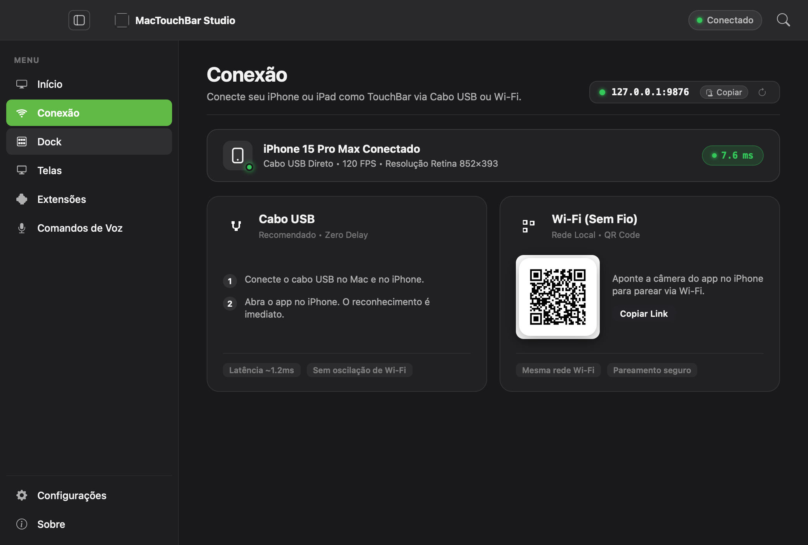
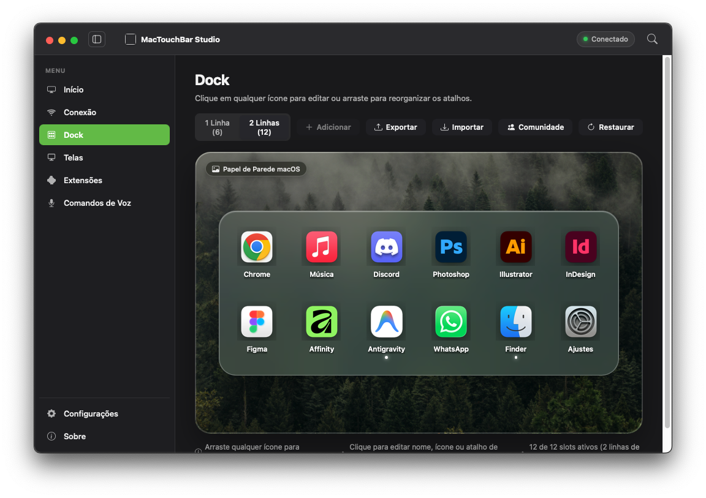
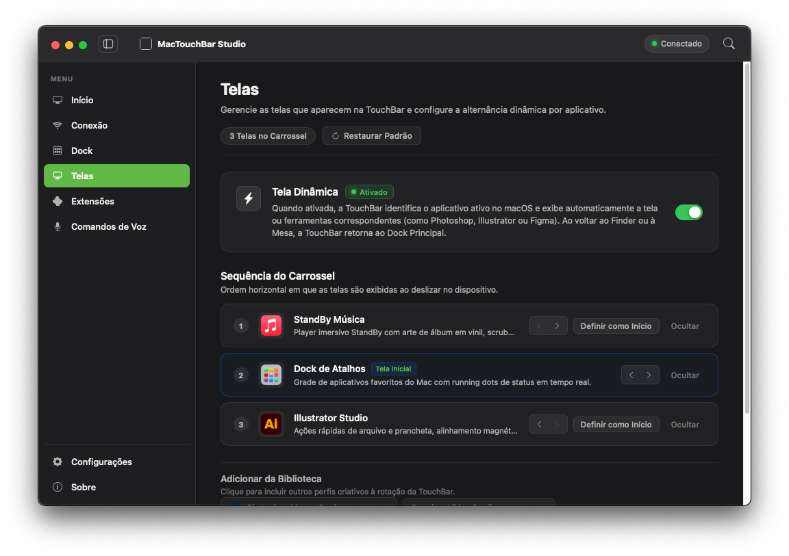
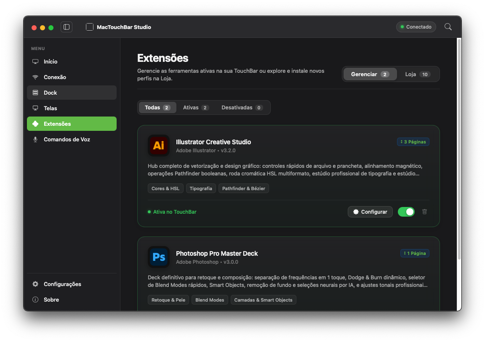
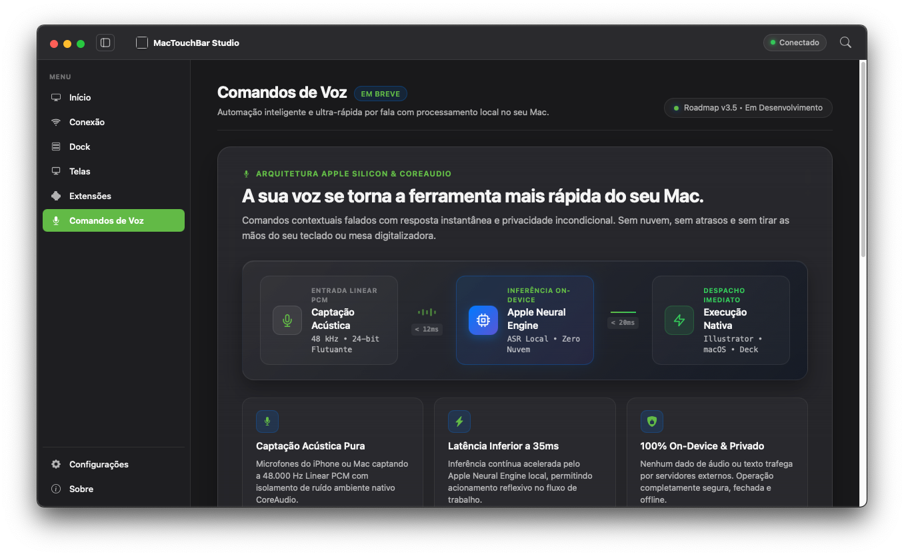

# MacTouchBar Studio

Transforme seu dispositivo Android, iPhone ou iPad em uma Touch Bar tátil e painel de atalhos contextuais para macOS.



MacTouchBar Studio é uma aplicação para macOS com clientes para **Android, iPhone e iPad** que permite utilizar seu celular ou tablet como uma superfície física de atalhos, automações e controles criativos. O app detecta automaticamente o programa em foco no Mac e adapta as ferramentas exibidas na tela do dispositivo em tempo real.

---

## Funcionalidades

- **Perfis contextuais automáticos**: Alterna os controles na tela conforme o app aberto no macOS (Adobe Illustrator, Photoshop, Figma, VS Code, Finder, etc.).
- **Conexão USB de baixa latência (~1.2ms)**: Comunicação direta via cabo USB para resposta instantânea ao toque, além de conexão sem fio via Wi-Fi local.
- **Suporte Multiplataforma**:
  - **Android**: APK nativo instalável com aceleração gráfica.
  - **iPhone e iPad**: App nativo distribuído via **AltStore / SideStore** (`.ipa`) ou acesso direto via WebApp.
- **Dock de atalhos customizável**: Permite criar e reorganizar grades de botões, disparadores de apps, scripts de sistema e macros.
- **Módulos para criativos (Add-ons)**:
  - **Illustrator**: Seletores de cor HSL/RGB, alinhamento magnético, ferramentas de vetor e ajustes tipográficos.
  - **Photoshop**: Retoque rápido, separação de frequência, opacidade, modos de mesclagem e máscaras.
  - **Figma & Edição**: Atalhos rápidos de componentes, frames e corte de timeline.
- **Controle por voz local**: Mapeamento de comandos falados para ações do macOS com processamento on-device via Apple Neural Engine.
- **Monitor de sistema**: Leitura em tempo real do uso de CPU, RAM, GPU e status de conexão.

---

## Screenshots

### Conexão e Pareamento (USB / Wi-Fi)
Configuração via cabo USB com baixa latência ou pareamento sem fio por QR Code para Android, iPhone e iPad.



### Editor de Dock
Personalização de atalhos, grade de 1 ou 2 linhas e organização de ícones.



### Gerenciamento de Telas
Definição da ordem do carrossel e comportamento da alternância automática por aplicativo.



### Extensões (Add-ons)
Módulos instaláveis para suítes de criação e automação de fluxo de trabalho.



### Comandos de Voz
Painel de automação por voz com processamento acústico local e baixa sobrecarga.



---

## Instalação e Uso

### 1. macOS (Servidor / Host)

**Requisitos**: macOS 13 (Ventura) ou superior e Xcode Command Line Tools.

```bash
# Clone o repositório
git clone https://github.com/luxfajah/mactouchbar-studio.git
cd mactouchbar-studio

# Compile e instale em /Applications
chmod +x mac-app-beta/build_beta.sh
./mac-app-beta/build_beta.sh
```

> **Permissões necessárias**:  
> No primeiro uso, acesse **Ajustes do Sistema > Privacidade e Segurança > Acessibilidade** e ative o **MacTouchBar Studio** para permitir o envio de eventos de teclado e atalhos aos aplicativos.

---

### 2. iPhone e iPad (iOS / iPadOS)

#### Via AltStore / SideStore (Recomendado)
Você pode adicionar a fonte oficial do MacTouchBar Studio diretamente no seu AltStore:

1. No seu iPhone ou iPad com **AltStore** instalado, abra a aba **Sources** e toque no botão `+`.
2. Adicione a URL da fonte oficial:
   ```text
   https://raw.githubusercontent.com/luxfajah/mactouchbar-studio/main/altstore.json
   ```
3. Toque em **Install** no app MacTouchBar Studio.

*(Ou baixe diretamente o arquivo [`MacTouchBarStudio.ipa`](MacTouchBarStudio.ipa) e faça o sideload pelo AltServer / SideStore / TrollStore).*

#### Via Navegador (Safari WebApp)
1. Com o app aberto no Mac, acesse a aba **Conexão**.
2. Aponte a câmera do iPhone/iPad para o **QR Code** ou acesse o endereço IP local.
3. No Safari, toque em **Compartilhar > Adicionar à Tela de Início**.

---

### 3. Android

1. Baixe o arquivo [`TouchbarHackintosh.apk`](TouchbarHackintosh.apk) presente na raiz deste repositório.
2. Habilite a instalação de fontes desconhecidas caso solicitado.
3. Instale o APK no seu celular ou tablet Android.
4. Conecte ao Mac via cabo USB ou Wi-Fi.

---

## Estrutura do Projeto

```
mactouchbar-studio/
├── mac-app-beta/            # Aplicação nativa macOS (Objective-C + WebKit)
│   ├── main.m               # Janela nativa, WKWebView e bridge JS/ObjC
│   ├── index.html           # Interface do usuário, dock e simulador
│   ├── Info.plist           # Configuração do bundle
│   └── build_beta.sh        # Script de compilação macOS
├── ios-app/                 # Aplicação nativa iOS / iPadOS (SwiftUI + WebKit)
│   ├── MacTouchBarApp.swift # Entrypoint iOS
│   ├── ContentView.swift    # View principal com Bonjour e Haptics
│   ├── Info.plist           # Configuração do bundle iOS
│   └── build_ipa.sh         # Script de empacotamento do .ipa
├── altstore.json            # Fonte oficial para AltStore e SideStore
├── MacTouchBarStudio.ipa    # Pacote de instalação para iPhone e iPad
├── TouchbarHackintosh.apk   # Cliente nativo Android
├── DeXPlay-AirPlay.apk      # Módulo complementar de receptor de tela
└── docs/screenshots/       # Imagens de demonstração
```

---

## Licença

Este projeto está sob a licença [MIT](LICENSE).
