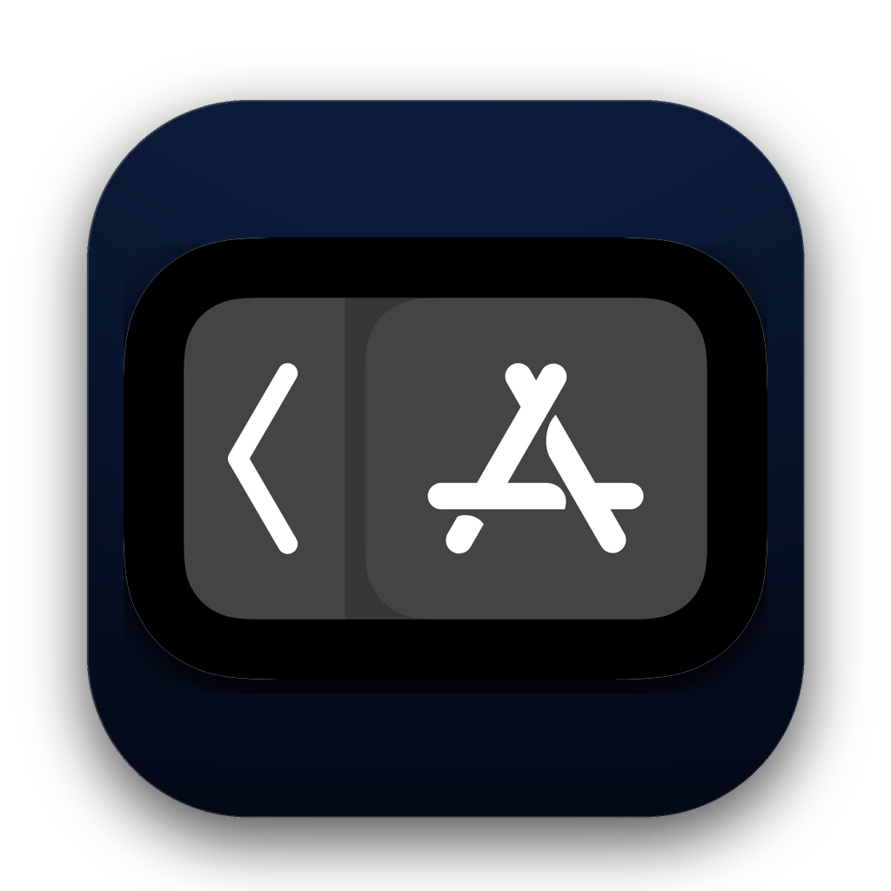

<div align="center">



# ⚡ MacTouchBar Studio
### O Stream Deck & Touch Bar Definitivo para Criadores no Mac — Usando seu Smartphone ou Tablet Android!

**Transforme seu smartphone, tablet Android ou iPad em uma central de controle tátil, macro pad profissional e estação de atalhos inteligentes com latência ultrabaixa de ~1.2ms.**

[](https://apple.com/macos)
[](TouchbarHackintosh.apk)
[-8A2BE2?style=for-the-badge&logo=speedtest&logoColor=white)](#-desempenho-instantâneo)
[](#-feito-para-quem-cria)
[](LICENSE)

<br/>

[🚀 O Que É](#-o-que-é-o-mactouchbar-studio) • [🎨 Feito Para Criativos](#-feito-para-quem-cria) • [📸 Galeria de Telas](#-conheça-todas-as-telas) • [🧩 Add-ons](#-hub-de-extensões-add-ons) • [🎙 Comandos de Voz](#-automação--comandos-de-voz) • [⚡ Como Instalar](#-instalação-e-uso-rápido)

---

</div>

## 🌟 O Que é o MacTouchBar Studio?

Esqueça hardwares caros de mais de **R$ 1.500** como o *Elgato Stream Deck*. Se você usa **MacBook, Mac Mini, Mac Studio, iMac ou Hackintosh**, você já tem a melhor tela tátil do mundo no seu bolso: o seu celular ou tablet.

O **MacTouchBar Studio** é um ecossistema profissional de produtividade que sincroniza instantaneamente o seu Mac com o seu dispositivo Android ou iOS.

Ele detecta automaticamente qual aplicativo está em foco na sua tela e **muda as ferramentas no seu dispositivo em tempo real**: seletores de cores e curvas no Illustrator, pincéis e camadas no Photoshop, frames no Figma, controles de corte e timeline no Premiere/Final Cut, ou compilações no VS Code.

---

## 🎨 Feito Para Quem Cria: Design, Ilustração, Foto e Edição de Vídeo

Aumente em até **3x a velocidade do seu fluxo de trabalho** e livre-se da necessidade de memorizar dezenas de combinações de teclas:

* 🖌 **Designers Gráficos & Ilustradores (Illustrator / Photoshop / Corel)**:
  Ajuste espessura de traço, opacidade de camadas, selecione cores contínuas em disco HSL/RGB, execute alinhamentos magnéticos e booleanas Pathfinder com apenas um toque.
* 📐 **UI/UX Designers (Figma / Sketch / Framer)**:
  Criação instantânea de frames, componentes, auto-layout, alternância de ferramentas e exportação de assets sem perder o foco na prancheta.
* 🎬 **Editores de Vídeo & Coloristas (Premiere Pro / After Effects / DaVinci Resolve / Final Cut)**:
  Botões dedicados para cortes na timeline (Razor), split, render, zoom de trilhas, mute e aplicação rápida de transições.
* 💻 **Desenvolvedores & Produtividade (VS Code / Xcode / Terminal)**:
  Disparo de builds, toggle de terminal, controle de commits git, snippets de código e macros customizados.

---

## 📸 Conheça Todas as Telas

<div align="center">

### 1. 🖥️ Início — Simulador Interativo de Touch Bar & Dock
Monitore os widgets ativos, status de conexão ultrarrápida (~1.2ms), atalhos de sistema e navegue fluidamente entre as telas.
<br/><br/>


<br/><br/>

### 2. ⚡ Conexão — Pareamento USB Instantâneo (~1.2ms) & Wi-Fi Sem Fio
Conexão plug-and-play via cabo USB com taxa de atualização de até 120 FPS e suporte a conexão sem fio via QR Code.
<br/><br/>


<br/><br/>

### 3. 🎛️ Dock — Editor Visual de Atalhos & Mac Deck
Personalize a sua grade de aplicativos favoritos com suporte a 1 ou 2 linhas, ícones do macOS em alta definição e reorganização por toque.
<br/><br/>


<br/><br/>

### 4. 📱 Telas — Alternância Dinâmica & Carrossel Contextual
Configure a detecção inteligente de aplicativos: a Touch Bar exibe as ferramentas certas assim que você abre o Illustrator, Photoshop ou Figma.
<br/><br/>


<br/><br/>

### 5. 🧩 Extensões (Add-ons) — Hub Modular de Ferramentas Criativas
Ative ou instale novos perfis profissionais dedicados para Adobe Illustrator Creative Studio, Photoshop Pro Master Deck e muito mais.
<br/><br/>


<br/><br/>

### 6. 🎙️ Comandos de Voz — Automação Inteligente On-Device
Aceleração nativa por fala com baixíssima latência e 100% de privacidade (sem envio para nuvem), ideal para uso com mesa digitalizadora.
<br/><br/>


</div>

---

## 🧩 Hub de Extensões (Add-ons) Nativos

O MacTouchBar Studio possui uma arquitetura modular expansível através de Add-ons:

* 🎨 **Illustrator Creative Studio**:
  - Paleta cromática HSL multiformato e seletor contínuo
  - Estúdio tipográfico com ajuste de entrelinha, tracking e fontes
  - Operações booleanas Pathfinder (Unir, Interseção, Excluir) em um toque
* 🖌 **Photoshop Pro Master Deck**:
  - Ações de retoque de pele e separação de frequências em 1 clique
  - Controle dinâmico de Dodge & Burn e Blend Modes rápidos
  - Gerenciamento avançado de Smart Objects e máscaras de camada
* 📐 **Figma & Motion**:
  - Criação rápida de componentes e variantes
  - Alinhamentos absolutos e atalhos de prototipagem

---

## 🎙 Automação & Comandos de Voz

Controle o seu Mac com a sua voz enquanto desenha ou edita:

* ⚡ **Latência Inferior a 35ms**: Processamento local contínuo acelerado pelo **Apple Neural Engine**.
* 🔒 **100% On-Device & Privado**: Nenhum dado de áudio ou texto sai da sua máquina. Operação segura, rápida e totalmente offline.
* ✍️ **Foco Total na Criação**: Diga *"Exportar PNG"*, *"Duplicar Camada"*, *"Criar Máscara"* sem soltar a caneta da mesa digitalizadora (Wacom / Huion / iPad).

---

## 🔥 Tabela Comparativa de Mercado

| Recurso | MacTouchBar Studio | Elgato Stream Deck | Apps Genéricos de Atalho |
|:---|:---:|:---:|:---:|
| **Preço** | **100% Gratuito & Open Source** | R$ 1.200 a R$ 2.400 | Assinaturas mensais |
| **Hardware Necessário** | Seu Celular / Tablet Android ou iPad | Hardware proprietário | Apenas telas específicas |
| **Tempo de Resposta** | **~1.2ms (Cabo USB Direto)** | ~5ms | 50ms - 150ms (Lag no Wi-Fi) |
| **Telas Dinâmicas por App**| ✅ Automático nativo | ⚠️ Requer configuração manual | ❌ Não |
| **Comandos de Voz** | ✅ Integrado (Apple Neural Engine) | ❌ Não possui | ❌ Não possui |
| **Compatibilidade Total** | ✅ MacBooks, Mac Mini, Studio e Hackintosh | ✅ Sim | ⚠️ Instável em Hackintosh |

---

## 🚀 Instalação e Uso Rápido

### 1. No Mac
```bash
# Clone o repositório
git clone https://github.com/luxfajah/mactouchbar-studio.git
cd mactouchbar-studio

# Compile e instale automaticamente em /Applications
chmod +x mac-app-beta/build_beta.sh
./mac-app-beta/build_beta.sh
```

### 2. No Android
1. Baixe o [`TouchbarHackintosh.apk`](TouchbarHackintosh.apk) presente na raiz deste projeto.
2. Instale o APK no seu aparelho Android.
3. Conecte via cabo USB (recomendado para latência de ~1.2ms) ou conecte via Wi-Fi apontando para o QR Code da tela de Conexão.

### 3. Permissões
Acesse **Ajustes do Sistema** > **Privacidade e Segurança** > **Acessibilidade** no Mac e habilite o **MacTouchBar Studio** para permitir a injeção instantânea dos atalhos.

---

## 🔍 Termos de Busca & Palavras-Chave (SEO)

> **Palavras-chave recomendadas:**  
> `stream deck android para mac` • `touch bar no android` • `touch bar virtual macbook hackintosh` • `atalhos mac no celular` • `automatização mac com android` • `deck de atalhos para photoshop illustrator figma` • `controlar mac pelo celular android` • `segundo monitor e macro pad macos` • `elgato stream deck alternative free mac` • `mac deck studio android` • `atalhos criativos macbook pro`

---

## 📄 Licença

Distribuído sob a licença **MIT**. Veja o arquivo [`LICENSE`](LICENSE) para mais detalhes.

---

<div align="center">
  <b>MacTouchBar Studio</b> — Feito com paixão por <a href="https://github.com/luxfajah">luxfajah</a> para criadores, designers e profissionais no Mac.
</div>
